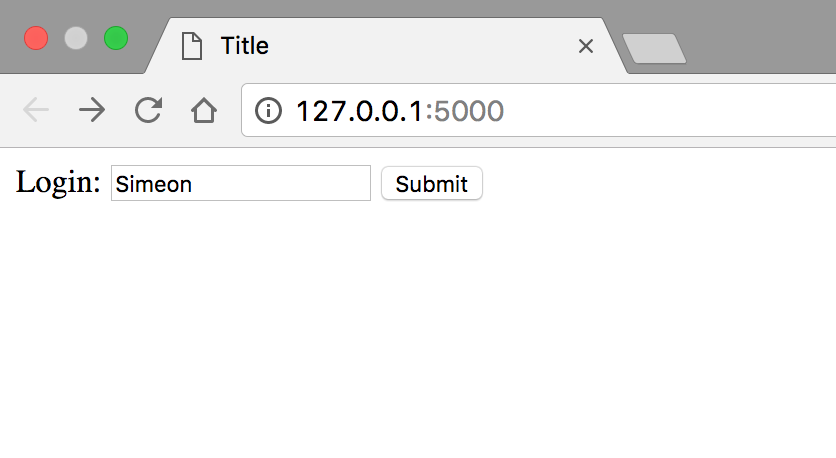
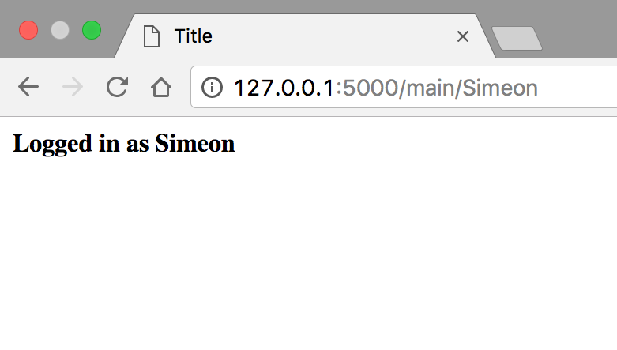

# Lesson 3 - Handling Form Values 

## Learning Objectives
* Capturing form values in the controller
* Using the Flask request method
* Creating a GET/POST route

## The Walkthrough
1. Create a Flask Application
	* Name it FlaskApp_03

2. Edit the main python file (FlaskApp_03.py)
	* Make it look like the following

```python
from flask import Flask, render_template, request, redirect, url_for

app = Flask(__name__)

@app.route('/main/<user>')
def main(user):
    return render_template("index.html", username=user)

@app.route('/')
def login():
    return render_template("login.html")

@app.route('/processform', methods=['GET', 'POST'])
def processform():
    user = request.form['user']
    return redirect(url_for('main', user=user))

if __name__ == '__main__':
    app.run()
```

3. Create an index page
	* In the template folder, create an index.html file
	* Make it look like the following

```html
<!DOCTYPE html>
<html lang="en">
<head>
    <meta charset="UTF-8">
    <title>Title</title>
</head>
<body>
    <strong>Logged in as <b>{{ username }}</b></strong>
</body>
</html>
```

3. Create a form page
	* In the template folder, create an login.html file
	* Make it look like the following

```html
<!DOCTYPE html>
<html lang="en">
<head>
    <meta charset="UTF-8">
    <title>Title</title>
</head>
<body>
    <form action="{{ url_for('processform') }}" method="POST" >
        Login: <input type="text" name="user" >
        <input type="submit" value="Submit" >
    </form>
</body>
</html>
```

If it is done properly, when you run your application, you will be able to navigate to localhost:5000 and see this:


## What is Going On