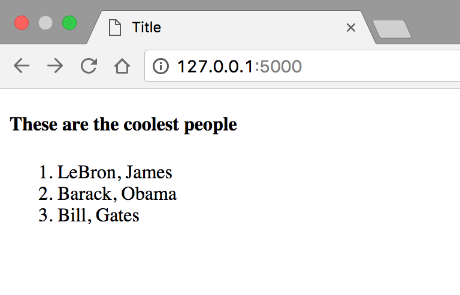

# Lesson 5 - Connecting to a database 

## Learning Objectives
* Connect to a sqlite database
* Create an object model using SQLalchemy

## The Walkthrough
1. Create a Flask Application
	* Name it FlaskApp_05

2. Edit the main python file (FlaskApp_05.py)
	* Make it look like the following

```python
from flask import Flask, render_template
from flask_sqlalchemy import SQLAlchemy

app = Flask(__name__)
app.config['SQLALCHEMY_DATABASE_URI'] = 'sqlite:///flaskr.db'
db = SQLAlchemy(app)

@app.route('/')
def hello_world():
    people = [
        Person("LeBron", "James"),
        Person("Barack", "Obama"),
        Person("Bill", "Gates")
    ]
    return render_template("index.html", people = people)

class Person(db.Model):
    id = db.Column(db.Integer, primary_key=True)
    firstname = db.Column(db.String(50))
    lastname = db.Column(db.String(50))

    def __init__(self, firstname, lastname):
        self.firstname = firstname
        self.lastname = lastname

if __name__ == '__main__':
    app.run()
```

3. Create an index page
	* In the template folder, create an index.html file
	* Make it look like the following

```html
<!DOCTYPE html>
<html lang="en">
<head>
    <meta charset="UTF-8">
    <title>Title</title>
</head>
<body>
    <h4>These are the coolest people</h4>
    <ol>
    
        <li>{{ person.firstname}}, {{ person.lastname}}</li>
    
    </ol>
</body>
</html>
```

If it is done properly, when you run your application, you will be able to navigate to localhost:5000 and see this:


## What is Going On