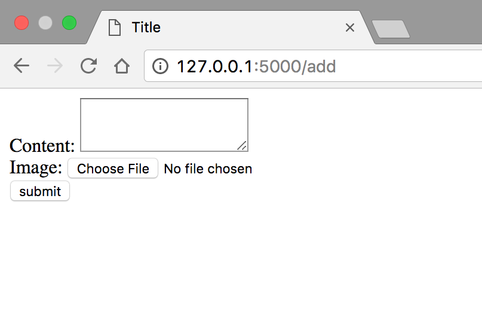

# Lesson 8 - Uploading Images to Spring Boot with Cloudinary

## Learning Objectives
* Upload images to Flask using Cloudinary

## The Walkthrough
1. Create a Flask Application
	* Name it FlaskApp_08
    
2. Sign up for a Cloudinary account (www.cloudinary.com) if you do not already have one 

3. You can install Cloudinary's module using either easy_install or pip package management tools:
```pip install cloudinary```.
If you are using PyCharm, you may also install using the gui.
```Pycharm > Preferences > Project Interpreter > Click plus > search cloudinary > Install package```

3. Create a file in the root directory named config.py
    * Put your environment variables in the config.py file like so:
    * You can get your keys from cloudinary
    
```python
CLOUDINARY_CLOUD_NAME="mycloudname"
CLOUDINARY_API_KEY="myapikey"
CLOUDINARY_API_SECRET="myapisecret"
```


4. Edit the main python file (FlaskApp_08.py)
	* Make it look like the following
    
```python
from flask import Flask, render_template, request, redirect, url_for
from flask_sqlalchemy import SQLAlchemy
from werkzeug import secure_filename
from config import *
import os
import cloudinary
import cloudinary.uploader
import cloudinary.api


app = Flask(__name__)
app.config['SQLALCHEMY_DATABASE_URI'] = 'sqlite:///flaskr.db'
app.config['UPLOAD_FOLDER'] = '/tmp/'
db = SQLAlchemy(app)


cloudinary.config(
    cloud_name = CLOUDINARY_CLOUD_NAME,
    api_key = CLOUDINARY_API_KEY,
    api_secret = CLOUDINARY_API_SECRET
)


@app.route('/')
def index():
    posts = Post.query.all()
    return render_template("index.html", posts=posts)


@app.route('/add')
def add():
    return render_template("form.html")


@app.route('/processform', methods=['GET','POST'])
def processform():
    content = request.form['content']
    f = request.files['image']
    filename = os.path.join(app.config['UPLOAD_FOLDER'], secure_filename(f.filename))
    f.save(filename)
    res = cloudinary.uploader.upload_large(filename, resource_type="auto")
    img_url = res['secure_url']

    os.remove(filename)
    post = Post(content, img_url)
    db.session.add(post)
    db.session.commit()

    return redirect(url_for('index'))


class Post(db.Model):
    id = db.Column(db.Integer, primary_key=True)
    content = db.Column(db.String(50))
    image = db.Column(db.String(50))

    def __init__(self, content, image):
        self.content = content
        self.image = image


if __name__ == '__main__':
    db.create_all()
    app.run()
```

3. Create a form page
	* In the template folder, create an form.html file
	* Make it look like the following
    
```python
<!DOCTYPE html>
<html lang="en">
<head>
    <meta charset="UTF-8">
    <title>Title</title>
</head>
<body>
    <form action="/processform" method="POST" enctype="multipart/form-data" >
        Content: <textarea rows="3" name="content" ></textarea><br>
        Image: <input type="file" name="image"><br>
        <input type="submit" value="submit">
    </form>
</body>
</html>
```

4. Create a index page
	* In the template folder, create an index.html file
	* Make it look like the following
    
```python
<!DOCTYPE html>
<html lang="en">
<head>
    <meta charset="UTF-8">
    <title>Title</title>
</head>
<body>
    <h2>My posts</h2>
    
        <div>
            <h4>{{ post.content }}</h4>
            
        </div>
    

<a href="/add" >Add a new post</a>
</body>
</html>
```
If it is done properly, when you run your application, you will be able to navigate to localhost:5000 and see this:




## What is Going On