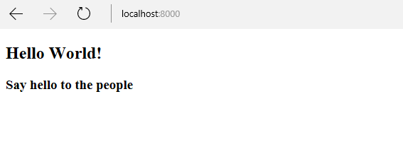

<!-- enter lesson number and title below separated by hyphen-->
# Lesson
## Learning Objectives
In this lesson you will learn how to pass data to views. This will be useful when you want to pass messages to pages and would like them to display.

## The Walkthrough
1. Create a new laravel application by typing "laravel new Lesson02" in the command prompt

2. Create a Template

As we have already seen, Laravel already has pages set up, so you can modify these.

Later on, you will also see how to create your own files and serve them.

* Open welcome.blade.php. You will find it in the resources/views folder.

Edit it to look like this:

``` html
<!DOCTYPE html>
<html lang="en">
<head>
    <meta charset="UTF-8" />
    <title>Title</title>
</head>
<body>
    <h2>Hello World!</h2>
    <h3>{{$message}}</h3>
</body>
</html>
```

3. Include a variable that will be displayed in the html file
* Open web.php. You will find it in the routes folder.

Change the function which returns the view to look like this:

```
php
Route::get('/', function () {
    return view('welcome')->with('message','Say hello to the people');
});
```


Run your application and open a browser, if you type in the URL http://localhost:8000 you should see this:


## What is Going On

## Questions
